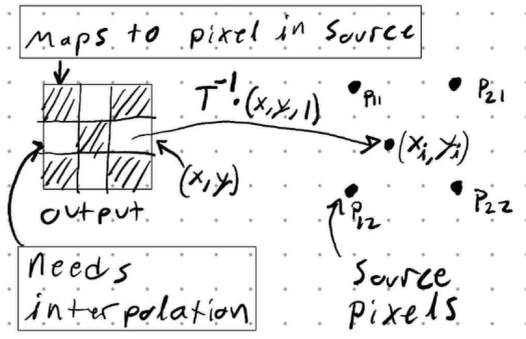

Code can be found at my [Github Repo](https://github.com/xTechon/CV_prog1/tree/main)

\pagebreak
# Program 1 - Affine Map

We have the following affine map:

$$
    \left [
    \begin{matrix}
        x1 \\ x2
    \end{matrix}
    \right ]
    \to
    \left [
    \begin{matrix}
        1 & 1 \\
        1 & 3
    \end{matrix}
    \right ]
    \left [
    \begin{matrix}
        x1 \\ x2
    \end{matrix}
    \right ]
    +
    \left[
    \begin{matrix}
        4 \\ 0      
    \end{matrix}
    \right ]
$$

This affine map can be converted into homogenous coordnates in 3 Dimensions to include the translation:

$$
    \left [
    \begin{matrix}
        1 & 1 & 4\\
        1 & 3 & 0\\
        0 & 0 & 1
    \end{matrix}
    \right ]
$$

This can then be decomposed into the following transformation matricies:

Shear: $\left [
    \begin{matrix}
        1 & 2 & 0\\
        0 & 1 & 0\\
        0 & 0 & 1
    \end{matrix}
    \right ]$
Rotation: $\left [
    \begin{matrix}
        \frac{\sqrt2}{2} & -\frac{\sqrt2}{2} & 0\\
        \frac{\sqrt2}{2} & \frac{\sqrt2}{2} & 0\\
        0 & 0 & 1
    \end{matrix}
    \right ]$
Scale: $\left [
    \begin{matrix}
        \sqrt2 & 0 & 0\\
        0 & \sqrt2 & 0\\
        0 & 0 & 1
    \end{matrix}
    \right ]$
Translation: $\left [
    \begin{matrix}
        1 & 0 & 4\\
        0 & 1 & 0\\
        0 & 0 & 1
    \end{matrix}
    \right ]$

In order to apply these transformation to an image in python, we'll first import a few external libraries, namely, `numpy`, `imageio`, and `matplotlib.pyplot`

After loading an image of a black square on a white background, we need to itterate over every pixel of this image. Before we can do so, we need to understand how images are stored once read by the `imageio` library.

```python       
i1 = iio.imread('blackSquare.png')
```


## Image Data Structure

Instead of every pixel value having a coordinate, it is placed in an array, with the "Y-Coordinates" Stored first followed by the "X-Coordinates". This data structure will be a 3D array, as the color data (RGB) of every pixel is stored in an array of length 3. For simplicity sake, I will only be working with images that do not have an alpha/transparency channel:
```
[
    [[255, 255, 255], [255, 255, 255], ..., [255, 255, 255]],
    [[0, 0, 0],       [0, 0, 0],       ..., [0, 0, 0]],
    [[255, 255, 255], [255, 255, 255], ..., [255, 255, 255]],
]
```
\centerline{Data Structure of images when read}

The "Coordinate" values will corresspond to indexes in the image array. I.e. `i1[y, x, :]` will get the pixel data at coordinate x,y.

Finally, the origin begins at the top left of the image, and the positive Y coordinates go to the bottom of the image and positive X coordinates go to the right of the image.

\pagebreak
## Transformation Algorithm

The algorithm for applying these transformations will go as follow:

1. Define the size of the output image
2. Take the inverse of a given transformation matrix
3. Itterate over every pixel in a defined output image
4. For every pixel in our output image, find it's equivalent location in the original image using the inverse transform
5. Implement the Bilinear Interpolation algorithm to determine the value of the pixel in the output image

### Define size of output image

The is very simple, I added the ability to both enter `height,width` dimensions manually,
```python
def imgTransform(src, matrix, outputSize=None):
    ...
    # set output size manually if set
    if outputSize is not None:
        height = outputSize[0]
        width = outputSize[1]
```

or we can attempt to find the minimum size needed by multiplying the farest corner of the original image by the provided transform. This does not work in all cases for rotations, but for time's sake this was successful most of the time:

```python
def imgTransform(src, matrix, outputSize=None):
    # calculate smallest possible size needed
    height, width, _ = src.shape
    width, height, _ = (matrix @ [width-1, height-1, 1]).astype(int)
```

Once we have the size of the output image, we can initalize it. Here, I set all pixels to 0 (black) for simplicity:

```python
    # init output values
    output = np.zeros((height, width, 3), dtype=np.uint8)
```

### Inverse of Transformation Matrix
To save on time, `numpy` has an implentation of this that can do it for us:
```python
    # take inverse of matrix
    inverse = np.linalg.inv(matrix)
```
\pagebreak
### Itterate over every pixel in Output image
We could itterate over every pixel from the source image, but it's easier to itterate over the output image. If we itterate over the source image, we will need to determine if the transformed pixel from source to output is within bounds of the output image dimensions. Furthermore, if the transform is a skew, magnify, or rotate, we would be left with gaps in the output image. To fill in the gaps, we would need to itterate over the output image to interpolate the pixels. If we have to go back and itterate over the output image to interpolate, there is little reason to itterate over the source image. This would explain why many image processing APIs (such as [OpenCV](https://docs.opencv.org/3.4/da/d54/group__imgproc__transform.html#ga0203d9ee5fcd28d40dbc4a1ea4451983) and [Scipy](https://docs.scipy.org/doc/scipy/reference/generated/scipy.ndimage.affine_transform.html)) will ask for or convert to, the inverse of the transform matrix.

```python
    # itterate rows
    for y, row in enumerate(output):
        # itterate columns
        for x, pixel in enumerate(row):
            # Apply to new image
            output[y, x, :] = bilinearInterpolation(src, inverse, y, x)
    return output
```
\centerline{End of `imgTransform` function}

I use Binlinear Interpolation to determine the value of every pixel in the output image.

### Bilinear Interpolation Implementation

Interpolation aims to solve the following problem:

{width="263" height="170"}

Where $T^{-1}$ is the inverse transform matrix. Unshaded squares with coordinates $x, y$ are pixels in the output image that do not exist as a pixel in the original image after the inverse trasformation is applied. The Points $P$ in the image are pixels from the original image.

After applying the inverse transformation matrix the resulting source image coordinates, $x_i, y_i$, will lie somewhere between the pixels of the source image.

```python
def bilinearInterpolation(src, inverse, y, x):
    ...
    # setup the coordinate vector from output image
    coord = np.array([x, y, 1])

    # find the point in the initial image
    xi, yi, _ = (inverse @ coord)
```
\pagebreak
In Bilinear Interpolation, the value will be the sum of interpolation in the x direction followed by the Y direction (this operation is commutative)

{width="269" height="171"}

```python
    # setup coordinates of pixels
    x1 = np.floor(xi).astype(int)
    x2 = np.ceil(xi).astype(int)
    y1 = np.floor(yi).astype(int)
    y2 = np.ceil(yi).astype(int)
    ...
    # get the originial surrounding values
    p11 = src[y1, x1, :]
    p12 = src[y2, x1, :]
    p21 = src[y1, x2, :]
    p22 = src[y2, x2, :]
```
Interpolation in the X direction:

$$
    \begin{matrix}
        Row_1 = P_{11} * \frac{(x_2 - x_i)}{(x_2 - x1)} + P_{21} * \frac{(x_i - x_1)}{(x_2 - x_1)}
        \\
        Row_2 = P_{12} * \frac{(x2 - xi)}{(x2 - x1)} + P_{22} * \frac{(xi - x1)}{(x2 - x1)}    
    \end{matrix}
$$

Interpolation in the Y direction:
$$
    Value = Row_1 * \frac{(y2 - yi)}{(y2 - y1)} + Row_2 * \frac{(yi - y1)}{(y2 - y1)}
$$


```python
    row1 = p11 * ((x2 - xi)/(x2 - x1)) + p21 * ((xi - x1)/(x2 - x1))
    row2 = p12 * ((x2 - xi)/(x2 - x1)) + p22 * ((xi - x1)/(x2 - x1))
    value = row1 * ((y2 - yi)/(y2 - y1)) + row2 * ((yi - y1)/(y2 - y1))

    return value
```
\pagebreak
### Bilinear Interpolation Edge Cases

There are still a few edge cases that need to be accounted for:

- Performing the inverse transform gives an out of bounds coordinate
- Performing the inverse transform gives a valid coordinate
- Only one of the coordniates are valid and the other is somewhere in between pixels

#### Inverse Transform out of bounds
We first take the size of the source image and check after taking the inverse transform if the result is out of bounds:
``` python
def bilinearInterpolation(src, inverse, y, x):
    # dimensions of source image
    height, width, _ = src.shape
    ...
    if x2 >= width or x1 < 0 or y2 >= height or y1 < 0:
        return (np.array([0,0,0]).astype(np.uint8))
```
I return a black pixel if it is out of bounds. Other APIs may allow you to decide on value to fill in for this case.

#### Inverse Transform valid coord
If the inverse transfrom gives a valid coordinate, we can simply return the source pixel value without further calculation:
```python
    # return if landed on valid initial coord
    if (x1 == x2) and (y1 == y2):
        return src[int(y1), int(x1), :]
```

#### Interpolation in 1D

The inverse transform may result in only one of the dimensions lying on a pixel in the source image. In this case, we only need to interpolate in the other direction:
```python
    # only one of the dimensions is a vaild initial coord
    elif (x1 == x2):
        value = p11 * ((y2 - yi)/(y2 - y1)) + p12 * ((yi - y1)/(y2 - y1))
        return value
    elif (y1 == y2):
        value = p12 * ((x2 - xi)/(x2 - x1)) + p22 * ((xi - x1)/(x2 - x1))
        return value
```
\pagebreak
## Results

Applying the algorithm for the affine transformation will result in the images below:

{width="500" height="305"}

{width="500" height="305"}

\pagebreak
# Program 3 - Image Blending

Goals:

1. Construct a Gaussian Image Pyramid
2. Construct a Laplacian Image Pyramid
3. Perform normal image reconstruction
4. Blend Images using a mask

Gaussian Kernel:

$$
    \frac{1}{256}
    \left [
    \begin{matrix}
        1 & 4 & 6 & 4 & 1 \\
        4 & 16 & 24 & 16 & 4 \\
        6 & 24 & 36 & 24 & 6 \\
        4 & 16 & 24 & 16 & 4 \\
        1 & 4 & 6 & 4 & 1
    \end{matrix}
    \right ]

$$

## Problem